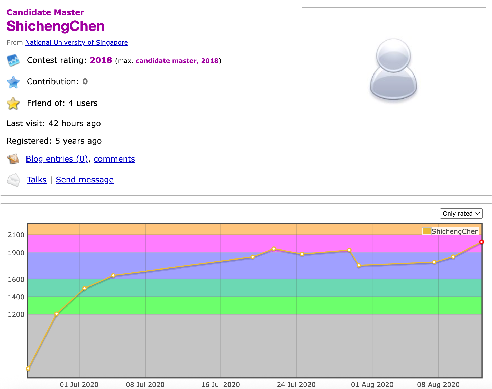

# Shicheng Chen

## Table of Contents
- [Experience](#experience)
- [Achievements](#achievements)
- [Certifications](#certifications)
- [Publications](#publications)

## Experience
- **Researcher** - NetVirta, Inc. · Full-time (Jan 2022 - Present)
- **Research Assistant** - National University of Singapore · Full-time (Oct 2018 - Dec 2021)
- **Project Officer** - Nanyang Technological University · Full-time (Oct 2017 - Sep 2018) · 1 yr Singapore

## Achievements
- **[Leetcode Weekly Contest](https://leetcode.com/u/c337134154/)**
  
  

- **[Google Kick Start](https://github.com/ShichengChen/ShichengChen.github.io/blob/master/0000000000435bad.pdf)**
  - Round H 2022: ranking 103 out of 5500 (top 1.8%)
  - Round E 2021: ranking 147 out of 6950 (top 2.1%)
  - Round D 2022: ranking 172 out of 8100 (top 2.1%)
  
  
  

- **[Codeforces](https://codeforces.com/profile/ShichengChen)**
  - Associated with National University of Singapore
  - Codeforces Round 664: official ranking 37 out of 12974 (top 0.2%)
  - Codeforces Round 653: official ranking 11 out of 11033 (top 0.09%)
  - Codeforces Round 652: official ranking 71 out of 14647 (top 0.48%)
  - Codeforces Round 629: official ranking 149 out of 15861 (top 0.93%)
  
  

## Certifications
- **[Generative AI with Large Language Models](https://www.coursera.org/account/accomplishments/verify/SEZBFGJNHBLY?utm_product=course)** 
  
  

- **[Natural Language Processing with Attention Models](https://www.coursera.org/account/accomplishments/verify/2LPHTK9AJBV1?utm_product=course)**
  
  

## Publications
- **[Direct, Near Real Time Animation of a 3D Tongue Model Using Non-Invasive Ultrasound Images](https://ieeexplore.ieee.org/abstract/document/8462096)** (**Oral**, ICASSP 18)

- **[Predicting Tongue Motion in Unlabeled Ultrasound Video Using 3D Convolutional Neural Networks](https://ieeexplore.ieee.org/abstract/document/8461957)** (**Poster**, ICASSP 18)

- **[Bus Travel Speed Prediction using Attention Network of Heterogeneous Correlation Features](https://epubs.siam.org/doi/abs/10.1137/1.9781611975673.9)** (SDM 19)

- **[A Sequential Spatial Temporal Resnet for Task Prediction in Spatial Crowdsourcing](https://link.springer.com/chapter/10.1007/978-3-030-18576-3_16)** (DASFAA 19)

- **[SemiHand: Semi-supervised Hand Pose Estimation with Consistency](https://openaccess.thecvf.com/content/ICCV2021/papers/Yang_SemiHand_Semi-Supervised_Hand_Pose_Estimation_With_Consistency_ICCV_2021_paper.pdf)** (**Poster** ICCV 21)

- **[Local and Global Point Cloud Reconstruction for 3D Hand Pose Estimation](https://arxiv.org/abs/2112.06389)** (BMVC 21)